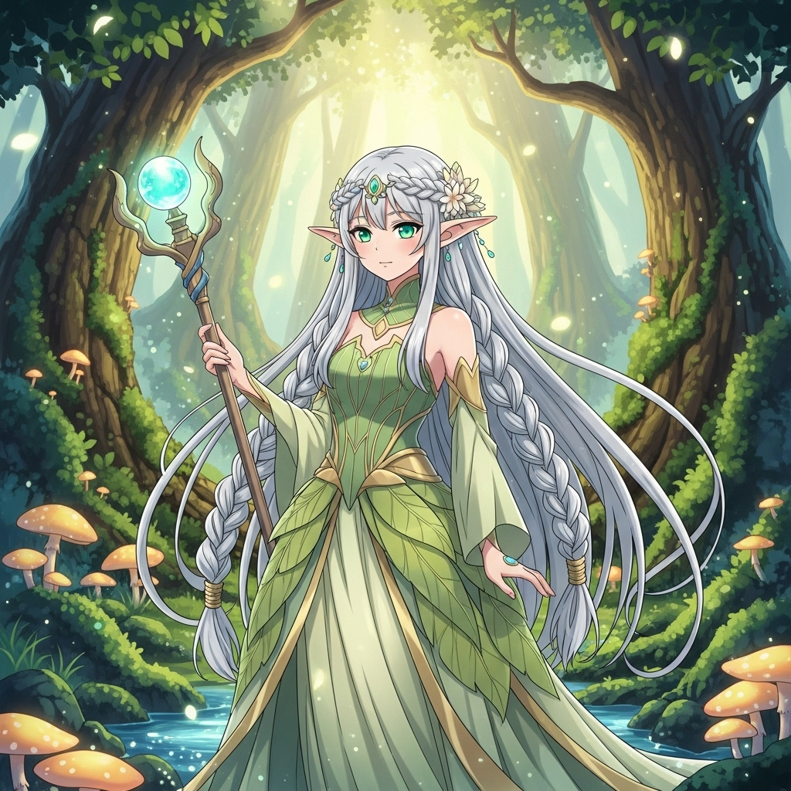

# Gemini PWA Client Mk-II

[本家PWA](https://github.com/ona-oni/geminipwa/)をベースに、独自の機能を追加したカスタマイズ版です。

バグの報告はコンソールログ付きでIssuesに上げてもらえると助かります。
個別のサポートは行っておりません。

「アプリの更新が失敗しました」のエラーが出た場合はお手数ですが、PCなら強制リフレッシュ（ctrl+shift+R）スマホなら設定から`https://kinkan04.github.io/Gemini-PWA-Mk-II/`のキャッシュを削除して下さい。

## 目次
*   [使い方](#使い方)
*   [Version 0.4 マルチモーダル対応&プロファイル機能](#version-04-マルチモーダル対応プロファイル機能)
*   [主な機能](#主な機能)
*   [Function Calling (Tools) の詳細](#function-calling-tools-の詳細)
    *   [Function Callingとは？](#function-callingとは)
    *   [仕様・注意点](#仕様注意点)
    *   [実装済みの関数一覧](#実装済みの関数一覧)
    *   [関数詳細](#関数詳細)
*   [更新履歴](#更新履歴)

## 使い方

### 1. はじめて利用する方

1.  **[こちらにアクセス](https://kinkan04.github.io/Gemini-PWA-Mk-II/)** してPWAを開きます。
2.  **Gemini APIキー**を準備します。（[APIキーの取得方法](https://ai.google.dev/gemini-api/docs/api-key)）
3.  画面右上の設定アイコンから設定画面を開き、APIキーを入力して保存します。
4.  チャット画面から会話を開始できます。

### 2. 既存ユーザーのアップデート方法

PWAの更新は、以下の手順で行ってください。以前訪問済みでキャッシュが残っていて更新されない場合もこちらを実行して下さい。

1.  設定画面を開き、『アプリを更新（キャッシュクリア）』ボタンを押します。
2.  万が一、初期化エラーなどが表示された場合は、`Ctrl + Shift + R` (Macの場合は `Cmd + Shift + R`) でページを強制的にリフレッシュしてください。

## Version 0.4 マルチモーダル対応&プロファイル機能

Version 0.4では、テキストだけでなく画像や動画を扱う**マルチモーダル機能**が大幅に強化されました。AIとの対話を通じて、物語の情景をイラスト化したり、キャラクターの姿を変化させたり、さらには短い動画を生成することも可能です。

これらの機能は、主に**Function Calling**を通じてAIが自律的に実行します。例えば、「ヒロインが微笑むイラストを描いて」と指示するだけで、AIが最適な画像生成関数を選択し、イラストを生成してくれます。

設定画面で「**Function Calling を使用する**」にチェックを入れるのをお忘れなく！

※設定のモデル選択で`gemini-2.5-flash-image-preview`（通称: Nano Banana）を選択することも可能ですが、`gemini-2.5-pro`を選択してFunctionCallingを使用した方が文章のクオリティは高いため選択非推奨です。

### 新しく追加された主なマルチモーダル関数

*   [`generate_image`](#generate_image): テキストから**画像を生成**します。
    *   **使い所**: 物語のシーン、キャラクターの服装や表情などをイラスト化したい時に。「夕暮れの街の様子を描いて」
*   [`edit_image`](#edit_image): 既存の画像や添付した画像を指示に従って**編集**します。
    *   **使い所**: 生成した画像に修正を加えたい時に。「（生成されたイラストに対して）彼女の髪を赤色に変えて」
*   [`generate_video`](#generate_video): テキストや画像から**動画を生成**します。
    *   **使い所**: キャラクターの短いアクションや表情の変化を描写したい時に。「このキャラクターが微笑む動画を作って」
*   [`set_background_image`](#set_background_image): チャット画面の**背景を動的に変更**します。
    *   **使い所**: 物語の場面転換に合わせて、背景を臨場感のあるものにしたい時に。「場所は王城に移り、背景を城の画像に変更」
*   [`display_layered_image`](#display_layered_image): **キャラクターと背景を合成**して表示します。
    *   **使い所**: 背景透過処理済みのキャラクターの立ち絵と、背景画像を組み合わせて、ゲームのようなシーンを描写したい時に。
*   [`set_ui_opacity`](#set_ui_opacity): **UIの透明度を変更**し、画面の雰囲気を演出します。
    *   **使い所**: 回想シーンで画面を白っぽくしたり、緊迫した場面で暗くしたりしたい時に。
### 使用例
| ユーザーの指示 & AIの動作 | 実行結果 |
| :--- | :--- |
| シンプルな日本語で画像生成を指示した例  **ユーザー:** `アニメ調の美しいエルフの姫を描いて`    **AIの行動:**  `generate_image`を、引数に`prompt='anime style illustration of a beautiful elf princess` を渡して実行。 | |
| プロンプトも含めて細かい設定を指示した例  **ユーザー:** `以下の設定で画像を生成して下さい。` `使用モデル:imagen-4.0-ultra-generate-001` `解像度:2k` `アスペクト比:16:9` `プロンプト:masterpiece, best quality, beautiful japanese anime-style illustration, `  `18 years old female,black long hair , bangs, circle eyes, beautiful pale pink eyes, `  `white shirts, red  ribbon bow tie, beige school jacket, `  `pastel pink check patterned pleated mini skirt, high school student, cherry blossom,  `  `cherry blossoms blooming,beautiful sky, sunny, petals, cute,`   **AIの行動:**  `generate_image`を、引数に`model='imagen-4.0-ultra-generate-001', sampleImageSize='2k',` ` aspectRatio=16:9,prompt='masterpiece, best quality, beautiful japanese anime-style` ` illustration, 18 years old female, black long hair , bangs, circle eyes, beautiful` ` pale pink eyes, white shirts, red  ribbon bow tie, beige school jacket, pastel pink` ` check patterned pleated mini skirt, high school student, cherry` ` blossom, cherry blossoms blooming, beautiful sky, sunny, petals, cute,` を渡して実行。 | |
| モデルが生成した画像を編集した例  **ユーザー:** `上記の画像を笑顔にして手を振らせて。`    **AIの行動:**  `edit_image`を、引数に`source_image_message_index=1, ` `prompt='make her smile and wave her hand` を渡して実行。 | |
| シンプルな日本語で動画生成を指示した例(※無料枠は不可)  **ユーザー:** `上記の画像を動画にして。`    **AIの行動:**  `generate_video`を、引数に`source_image_message_index=1, ` `prompt='make her smile and wave her hand` を渡して実行。 | |
### ⚠️ マルチモーダル生成モデル利用に関する重要な注意点

これらのマルチモーダル機能は、Googleの強力な生成AIモデルを利用しますが、APIの利用にはいくつかの制限があります。

*   **無料枠（Free Tier）でのモデル制限**:
    *   無料枠で画像生成・編集が可能なモデルは、現在**`gemini-2.5-flash-image-preview`（通称: Nano Banana）のみ**です。無料枠のRPD（1日でリクエスト可能な数）は100です。
    *   無料枠ユーザーが画像生成を行う際は、プロンプトに「`gemini-2.5-flash-image-preview`を使用して下さい。」と明示的に記載して下さい。指定しなかったり、他のモデル（`imagen-4.0`など）が指定されると、APIエラーが発生します。
    *   無料枠で動画生成モデル（Veo3）は使用できません。
    *   FunctionCalling使用時はモデル呼び出し→FunctionCalling実行→モデル呼び出しというステップを踏みます。1回のリクエストで複数回リクエスト消費があることに留意して下さい。自動リトライ機能が作動した場合も同様にカウントが消費されますので、ご注意ください。

*   **従量課金（Tier 1以上）でのRPM/RPD制限**:
    *   動画生成に使用される`veo-3.0`モデルは非常に強力ですが、Tier 1ユーザーでも**1日あたりのリクエスト数（RPD）の上限が10回**と非常に少ないです（2025年9月時点）。ご利用は計画的にお願いします。
    *   動画を生成させる場合、入力トークンと出力トークンの制限には気を付けて下さい。特に添付画像を使用した動画生成や、設定でmaxtokenの設定を行っている場合はエラーが発生する可能性があります。
    *   **1回の送受信で複数回のリクエストが消費される**ことがあります。例えば、「イラストを描いて」という指示に対し、AIは「①Function Callingで画像を生成 → ②生成結果を元にテキスト応答を生成」というステップを踏むため、内部的にAPIリクエストが複数回発生します。自動リトライ機能が作動した場合も同様にカウントが消費されますので、ご注意ください。

*   **マルチモーダルモデルはNSFW規制が厳し目です。入力/出力に陰部や乳首等が含まれるとエラーを返します。文章と違い、脱獄は現時点では出来ないようです。（着衣越しなら微エロは出せます🎉）**
*   **2025/09現在、`gemini-2.5-pro`モデルにて過負荷によるエラーが多発しています。FunctionCalling実行中にエラーが発生した場合は最初からリトライになります。**
*   **動画生成に関してはRPDが10と非常に少なく、デバッグが進まないため現在テスト実装になります。バグはあるものだと思って下さい。現段階では動画をIndexedDBに保存する処理を入れていないのでリロードしたら消えます。**

### プロファイル機能：AIの使い分けを簡単に

Version 0.4から、APIキーやモデル、システムプロンプト、各種パラメータなどの設定一式を「プロファイル」として名前を付けて保存し、簡単に切り替えられるようになりました。

これにより、例えば以下のようなAIの使い分けが瞬時に可能になります。

| プロファイル名（例） | 主な設定                                                                                             |
| :------------- | :--------------------------------------------------------------------------------------------------- |
| **コーディング**   | **モデル:** `gemini-2.5-pro` **システムプロンプト:** `あなたは熟練のプログラマーです...`         |
| **嫁チャ**         | **モデル:** `gemini-2.5-Pro` **システムプロンプト:** `あなたは31歳の美咲です...` |
| **小説**         | **モデル:** `gemini-2.5-flash` **システムプロンプト:** `あなたは創造的な作家です...` |
| **TRPG**         | **モデル:** `gemini-2.5-flash` **システムプロンプト:** `あなたは厳格なゲームマスターです...` |

*   **プロファイルごとに名前とアイコンを設定**でき、視覚的に管理できます。
*   チャット入力欄の左側にあるアイコンや、設定画面からいつでもプロファイルを切り替えられます。
*   設定はリアルタイムで自動保存されるため、「上書き保存」ボタンは不要になりました。
*   チャット画面の背景画像は全てのプロファイルで共用です。

## 主な機能

### APIエラー時の自動リトライ
APIからの応答が空だったり、「PROHIBITED_CONTENT」などのエラーが返されたりした場合に、設定した回数まで自動で再送信を試みます。

### 生成文章の校正
APIが生成した文章を、別のモデル（デフォルト: `gemini-2.5-flash`）で校正できます。冗長な読点を抑制するなどの調整が可能です。会話が長くなり、文体に癖が出てきた際の利用を推奨します。

### 画像のサムネイル表示
チャット欄に大きな画像が投稿された場合、自動でサムネイルを生成します。クリックすると元サイズの画像が表示されます。

### Function Calling (高機能ツール連携)
計算、記憶、Web検索、物語進行の管理など、AIが状況に応じて様々なツール（プログラム）を呼び出せる機能です。詳細は次項で解説します。

### プロファイル機能
APIキーやモデル、システムプロンプトなどの設定一式を「プロファイル」として複数保存し、ワンタッチで切り替えられる機能です。これにより、「コーディング用アシスタント」と「小説執筆パートナー」のように、用途に応じたAIのペルソナを瞬時に使い分けることが可能になります。[詳細はこちら](#プロファイル機能aiの使い分けを簡単に)

---

## Function Calling (Tools) の詳細

本PWAの最大の特徴です。設定画面の『Function Calling を使用する』にチェックを入れることで有効になります。

### Function Callingとは？

AIがユーザーの意図を汲み取り、事前に用意された様々な「ツール（関数）」を自律的に実行する機能です。

> **（例）ユーザーとの会話から、AIが記憶ツールを自発的に使用する**
>
> **ユーザー:** 「俺の名前はたけしで、誕生日は11月11日だよ」
>
> ↓
>
> **AIの思考:** （この人の名前は『たけし』で誕生日は『11月11日』… 忘れないように記憶しておこう！）
>
> ↓
>
> **ツールの実行:** `manage_persistent_memory` という関数を呼び出し、名前と誕生日を保存する。
>
> ↓
>
> **AIの応答:** 「承知いたしました。お名前と誕生日、覚えておきますね。」

このように、明示的に「覚えて」と言われなくても、AIが文脈を判断して最適なツールを選択・実行し、より賢く、気の利いた応答を返せるようになります。

以下は本機能を体験するテストプロンプトになります。
*   **[孤島の洋館に7人の美女と共に閉じ込められて探偵ごっこするプロンプト](https://rentry.org/d5vqbkhs)**
*   **[Function Calling機能テストTRPGプロンプト](https://rentry.org/zyfkhnxt)**

### 仕様・注意点

*   **関数の手動実行**: AIは自発的に関数を使用しますが、「`1d100`でダイスを振って」のように、会話で明示的に指示することで、より確実に関数を実行させることができます。
*   **プロンプトへの組み込み**: AIによる自発的な関数の実行に全てを任せると抜けが有ったり勝手にダイスを振ったりするので、プロンプトで専用のルールを設けると効果的です。
*   **実行ログ**: モデルが関数を使用すると、生成された文章の下部に使用した関数名が表示されます。
*   **データ保存**: `manage_persistent_memory`などで記憶した情報は、ブラウザのデータベース（IndexedDB）に保存されます。このデータは会話履歴のエクスポート/インポートに含まれるため、環境を移行しても記憶を引き継ぐことが可能です。
*   **保存されたデータの確認**: IndexedDBに保存された情報は、会話をエクスポートしてテキストファイルを開くか、ブラウザの開発者メニューのコンソール等で確認が可能です。
*   **リトライ時の挙動**: 生成を手動でリトライした場合、直前に実行された関数の効果（ステータス変更やアイテム追加など）は**取り消されません**。
*   ⚠️ **Google Searchとの併用不可**: APIの仕様上、標準のGoogle Search機能とFunction Callingは同時に利用できません。両方が有効な場合、**Function Callingが優先**されます。
*   💡 **FC有効時のWeb検索**: Function Callingが有効な状態でWeb検索を行いたい場合は、`search_web`関数が自動的に使用されます。（ただし、[事前の設定](#search_web関数の設定方法)が必要）

### 実装済みの関数一覧
*(各項目をクリックすると、ページ下部の詳細説明にジャンプします)*

#### ユーティリティ系
*   [`calculate`](#calculate): 正確な四則演算を行います。
*   [`manage_persistent_memory`](#manage_persistent_memory): 会話内の短期的な情報を記憶・管理します。
*   [`getCurrentDateTime`](#getcurrentdatetime): 現実世界の現在の日付と時刻（日本時間）を取得します。
*   [`manage_timer`](#manage_timer): 指定時間後に通知するタイマーを設定します。
*   [`search_web`](#search_web): Web検索を実行します。（※別途設定が必要）
*   [`get_random_integer`](#get_random_integer): 指定範囲のランダムな整数を生成します。
*   [`get_random_choice`](#get_random_choice): リストの中からランダムに項目を選択します。
*   [`generate_random_string`](#generate_random_string): パスワードのようなランダムな文字列を生成します。

#### ロールプレイング・物語進行系
*   [`rollDice`](#rolldice): `1d100` や `2d6+5` 形式のダイスロールを実行します。
*   [`manage_character_status`](#manage_character_status): キャラクターのHPやMPなどのステータスを管理します。
*   [`manage_inventory`](#manage_inventory): アイテムの所持状況を管理します。
*   [`manage_game_date`](#manage_game_date): 物語内の経過日数を管理します。
*   [`manage_flags`](#manage_flags): 物語の分岐条件となるフラグを管理します。
*   [`manage_scene`](#manage_scene): 場所、時間、雰囲気などの場面設定を管理します。
*   [`manage_relationship`](#manage_relationship): キャラクター間の好感度などの関係値を管理します。
*   [`manage_style_profile`](#manage_style_profile): キャラクターの口調や一人称などの話し方を設定します。

#### 画像・動画・UI操作系
*   [`generate_image`](#generate_image): テキストプロンプトから画像を生成します。
*   [`edit_image`](#edit_image): 既存の画像をテキストプロンプトで編集します。
*   [`generate_video`](#generate_video): テキストや画像から動画を生成します。
*   [`manage_image_assets`](#manage_image_assets): ブラウザのDBに画像を保存します。
*   [`set_background_image`](#set_background_image): チャット画面の背景画像を指定したURLの画像に一時的に変更します。
*   [`display_layered_image`](#display_layered_image): 背景画像とキャラクター画像を重ねて表示します。
*   [`set_ui_opacity`](#set_ui_opacity): 背景オーバーレイやメッセージバブルの透明度を変更します。

---

### 関数詳細

#### ユーティリティ系
これらの関数は、会話の補助や一般的なタスクを実行します。

##### `calculate`
*   **概要**: 四則演算などの数学的な計算式を評価し、正確な結果を返します。
*   **引数**:
    *   `expression` (string): `'2 * (3 + 5)'` のような計算式。
*   **使い道**: 会話中で計算が必要になった際に、正確な答えをAIに提供させます。（例：「税込み価格を計算して」）

##### `manage_persistent_memory`
*   **概要**: 現在の会話セッション内での短期的な記憶を管理します。記念日や登場人物の設定など、後で参照したい情報をAIに覚えさせることができます。
*   **引数**:
    *   `action` (string): `add`, `get`, `delete`, `list` のいずれか。
    *   `key` (string): 情報を識別するための名前。（例: `'次の目的地'`）
    *   `value` (string): 記憶させる情報の内容。（例: `'東の塔'`）
*   **使い道**: AIとの会話で決まった設定を、会話が続いている間は忘れさせないようにします。（例：「私の名前は『Taro』だよ。覚えておいて」）

##### `getCurrentDateTime`
*   **概要**: 現実世界の現在の日付と時刻（日本時間）を取得します。
*   **引数**: なし
*   **使い道**:
    *   **恋愛ロールプレイ**: ヒロインとの会話の中で日付、曜日、時間に関連した話題を使用できます。
    *   **小説**: プレイヤーの現実時間とリンクさせた物語を作成できます。
    *   *注意: 作品の世界観が現代ではない場合など、文脈にそぐわない場合は使用されません。*

##### `manage_timer`
*   **概要**: 指定した時間（分単位）でタイマーを設定、確認、停止します。タイマーが時間切れになると、その事実がAIに通知されます。
*   **引数**:
    *   `action` (string): `start`, `check`, `stop` のいずれか。
    *   `timer_name` (string): タイマーを識別するための名前。（例: `'爆弾解除タイマー'`）
    *   `duration_minutes` (number): タイマーの期間（分）。
*   **使い道**:
    *   **時間制限イベント**: 「3分以内に部屋から脱出しろ！」のような状況を作成できます。
    *   **時間差イベント**: 「設定時間内に返信がなければ、ヒロインが追い連絡をする」といった演出が可能です。

##### `search_web`
*   **概要**: Web検索を実行します。（※本機能は[事前の設定](#search_web関数の設定方法)が必要です）
*   **引数**:
    *   `query` (string): 検索キーワードや質問文。例: `'日本の城下町の発展の歴史'`, `'今日の東京の天気'`
*   **使い道**: AI自身の知識にない最新情報、専門知識、具体的なデータが必要な場合に使用します。

##### `get_random_integer`
*   **概要**: 指定された最小値と最大値の範囲内で、ランダムな整数を生成します。
*   **引数**:
    *   `min` (number): 乱数の最小値（この値も含まれる）。
    *   `max` (number): 乱数の最大値（この値も含まれる）。
    *   `count` (number): 生成する乱数の個数（デフォルト: 1）。
*   **使い道**: 「50%の確率」や「1から10までのランダムな数字」など、一般的な確率計算や数値のランダム化が必要な場合に使用。

##### `get_random_choice`
*   **概要**: 提供されたリストの中から、ランダムに一つまたは複数の項目を選択します。
*   **引数**:
    *   `list` (array): 選択肢となる項目を含む配列。例: `['リンゴ', 'バナナ', 'オレンジ']`
    *   `count` (number): 選択する項目の個数（デフォルト: 1）。
*   **使い道**: くじ引き、ガチャ、アイテムのランダム選択、登場人物の行動のランダム決定などに使用。

##### `generate_random_string`
*   **概要**: 指定された条件に基づいて、ランダムな文字列（パスワード、IDなど）を生成します。
*   **引数**:
    *   `length` (number): 文字列の長さ。
    *   `count` (number): 生成する文字列の個数（デフォルト: 1）。
    *   `use_uppercase` (boolean): 大文字英字を含めるか（デフォルト: true）。
    *   `use_lowercase` (boolean): 小文字英字を含めるか（デフォルト: true）。
    *   `use_numbers` (boolean): 数字を含めるか（デフォルト: true）。
    *   `use_symbols` (boolean): 記号を含めるか（デフォルト: false）。
*   **使い道**: 物語の中で、意味を持たないユニークな文字列や機械的に生成されたコードが必要な場合に使用。

#### ロールプレイング・物語進行系

##### `rollDice`
*   **概要**: TRPGなどで使われる、指定された形式のダイスを振って結果を返します。
*   **引数**:
    *   `expression` (string): `'1d100'`, `'2d6+5'` のようなダイスロールの式。
*   **使い道**: キャラクターの行動判定など、ダイスロールが必要な場面で利用します。（例：「成功判定、1d100でどうぞ」）

##### `manage_character_status`
*   **概要**: 登場キャラクターのステータス（HP, MPなど）を管理します。
*   **引数**:
    *   `character_name` (string): 対象キャラクター名。
    *   `action` (string): `set`, `increase`, `decrease`, `get` のいずれか。
    *   `status_key` (string): ステータスの種類。（例: `'HP'`）
    *   `value` (number): 操作する値。
*   **使い道**: 戦闘やイベントでキャラクターのパラメータが変動した際に使用します。（例：「主人公のHPが10減少した」）

##### `manage_inventory`
*   **概要**: キャラクターの所持品を管理します。
*   **引数**:
    *   `character_name` (string): 対象キャラクター名。
    *   `action` (string): `add`, `remove`, `check` のいずれか。
    *   `item_name` (string): アイテム名。
    *   `quantity` (number): 個数。
*   **使い道**: アイテムの入手や消費を記録します。（例：「主人公は薬草を1つ手に入れた」）

##### `manage_game_date`
*   **概要**: 物語やゲーム内の経過日数を管理します。
*   **引数**:
    *   `action` (string): `pass_days`, `get_current_day` のいずれか。
    *   `days` (number): 経過させる日数。
*   **使い道**: 物語の時間を進めたいときに使用します。（例：「一夜明けた」）

##### `manage_flags`
*   **概要**: 物語の進行度や世界の状況をフラグ（真偽値）やカウンター（数値）で管理します。
*   **引数**:
    *   `action` (string): `set`, `get`, `toggle`, `increase`, `decrease`, `delete` のいずれか。
    *   `key` (string): フラグを識別するための名前。（例: `'扉A解錠済'`）
    *   `value` (string): 設定する値（`'true'`, `'false'`, または数値を文字列で）。
*   **使い道**: イベントの発生条件を管理し、物語の分岐を制御します。
    *   **TRPG**: 「世界の汚染度が100になったらボスを出現させる」
    *   **ノベルゲーム**: 「重要フラグがOFFのまま終盤に到達したらバッドエンドに分岐させる」

##### `manage_scene`
*   **概要**: 物語の場面設定（場所、時間帯、雰囲気、視点など）を管理します。
*   **引数**:
    *   `action` (string): `set`, `get`, `push`, `pop` のいずれか。
    *   `location` (string): 場所。
    *   `time_of_day` (string): 時間帯 (`morning`, `noon` など)。
    *   `mood` (string): 雰囲気 (`tense`, `calm` など)。
    *   `pov` (string): 視点 (`first`, `third`)。
*   **使い道**: 場面転換や視点変更をAIに明確に指示し、描写の一貫性を保ちます。（例：「場面は変わって、夜の王城。雰囲気は緊迫感がある感じで」）

##### `manage_relationship`
*   **概要**: キャラクター間の関係値（好感度、信頼度など）を多軸で管理します。時間経過による関係値の減衰も設定可能です。
*   **引数**:
    *   `action` (string): `set`, `increase`, `decrease`, `get` など。
    *   `source_character` (string): 関係の主体となるキャラクター。
    *   `target_character` (string): 関係の対象となるキャラクター。
    *   `axis` (string): 関係の種類。（例: `'好感度'`）
    *   `value` (number): 操作する値。
    *   `decay_value` (number): 時間経過で1日あたりに変化させる値。（例: `-1`）
*   **使い道**: キャラクターの行動によって変化する人間関係を数値で管理し、AIの応答（態度や口調）に反映させます。（例：「ヒロインAから主人公への好感度が10上がった」）

##### `manage_style_profile`
*   **概要**: キャラクターの口調、一人称、方言などの話し方のスタイルを設定・確認します。
*   **引数**:
    *   `action` (string): `set`, `get`, `list` のいずれか。
    *   `character_name` (string): 操作対象のキャラクター名（地の文の場合は `'地の文'`）。
    *   `profile_name` (string): 定義済みの口調プリセット名（`'polite'`, `'casual'` など）。
    *   `overrides` (object): プリセットの一部を上書きする設定。例: `{'first_person': 'ボク'}`
*   **使い道**: キャラクターの初登場時や、心情が大きく変化した際に呼び出し、その後の会話スタイルに一貫性を持たせます。

#### 画像・動画・UI操作系
これらの関数は、物語の視覚的な演出を強化したり、UIを動的に変更したりします。

##### `generate_image`
*   **概要**: テキストプロンプトから画像を生成します。`imagen-4.0`ファミリーや`gemini-2.5-flash-image-preview`(Nano Banana)モデルを利用します。
*   **引数**:
    *   `prompt` (string): 生成したい画像の内容を表す**英語の**プロンプト。
    *   `model` (string): (任意) 使用するモデルを以下の中から明示的に指定します。指定が無い場合は`imagen-4.0-generate-001`が使用されます。
        *   imagen-4.0-generate-001
        *   imagen-4.0-ultra-generate-001
        *   imagen-4.0-fast-generate-001
        *   gemini-2.5-flash-image-preview
    *   `numberOfImages` (number): (任意) 生成する枚数（1～4）。
    *   `sampleImageSize`（string）: （任意）生成画像の解像度を指定します。1Kは標準、2Kは高解像度。
    *   `aspectRatio`（string）: （任意）生成画像のアスペクト比を["1:1","3:4","4:3","9:16","16:9"]から指定します。指定がなければ1:1。
*   **使い道**: 物語のシーンや登場人物の姿を視覚化します。（例：「金髪碧眼の美しいエルフの姫の画像を生成して」）

##### `edit_image`
*   **概要**: 既存の画像を、テキストプロンプトの指示に基づいて編集します。`gemini-2.5-flash-image-preview`(Nano Banana)モデルを使用します。
*   **引数**:
    *   `prompt` (string): 画像をどのように編集するかを指示する**英語の**プロンプト。
    *   `source_image_message_index` (number): 編集対象の画像が含まれるメッセージのインデックス番号。ユーザーの現在のプロンプトが0、その一つ前のAIの応答が1となります。
*   **使い道**: 生成した画像に修正を加えます。（例：「（生成された画像に対して）この姫の髪を赤色にして」）

##### `generate_video`※テスト実装
*   **概要**: テキストプロンプトや既存の画像から短い動画を生成します。`veo-3.0`モデルを使用します。
*   **引数**:
    *   `prompt` (string): 生成したい動画の内容を表す**英語の**プロンプト。
    *   `negative_prompt`（string）:（任意）動画に含めたくない要素を説明する**英語の**ネガティブプロンプト。 
    *   `source_image_message_index` (number): (任意) 動画の元になる画像が含まれるメッセージのインデックス番号。
    *   `aspect_ratio`（string）: （任意）動画のアスペクト比。'16:9' (横長), '9:16' (縦長), '1:1' (正方形) など。デフォルトは '16:9'。
*   **使い道**: 動きのあるシーンを描写します。（例：「この姫が微笑む動画を生成して」）

##### `manage_image_assets`
*   **概要**: ユーザーが提供した画像を、後から再利用できるように名前を付けてアプリ内に永続的に保存・管理します。キャラクターの立ち絵や背景など、繰り返し使用する画像を保存するのに使用します。
*   **引数**:
    *   `action` (string): 実行する操作を選択します。'save': 画像を保存/上書き, 'get': 保存済み画像を取得して表示, 'delete': 画像を削除, 'list': 保存されている全画像の名前を一覧表示。
    *   `asset_name`（string）: 画像を識別するための一意の名前。例: 'キャラAの立ち絵', '森の背景'
    *   `source_image_message_index`（number）：'save'アクション時に必須。保存元となる画像が含まれるメッセージのインデックス番号。ユーザーの現在のプロンプトが0、その一つ前のAIの応答が1となります。
*   **使い道**: 画像をブラウザのDB(IndexedDB)に保存します。キャラクターの基準となる立ち絵（例：「キャラAの基本の姿」）を一度保存しておけば、以降の会話で「（保存した）キャラAを笑顔にして」のように指示するだけで、**同じキャラクターの表情差分を簡単に作成できます。** これにより、物語を通じてキャラクターの見た目の一貫性を保つことが容易になります。

##### `set_background_image`
*   **概要**: チャット画面の背景画像を、指定されたURLの画像に**一時的に**変更します。（※リロードすると元に戻ります）
*   **引数**:
    *   `image_url` (string): 表示したい画像のURL。
*   **使い道**: 物語の場面転換に合わせて、背景を臨場感のあるものに変更します。（例：「`manage_scene`で場所を『王城』に変更し、`set_background_image`で王城の画像のURLを指定する」）

##### `display_layered_image`※テスト実装
*   **概要**: 背景画像の上にキャラクター画像を重ねて、一枚の絵のようにメッセージとして表示します。
*   **引数**:
    *   `character_url` (string): 前景に表示するキャラクター画像のURL。
    *   `background_url` (string): (任意) 背景画像のURL。指定しない場合は現在のチャット背景が使われます。
*   **使い道**: キャラクターの立ち絵と背景を組み合わせたシーン描写に使用します。

##### `set_ui_opacity`
*   **概要**: チャット画面のUI要素（背景オーバーレイ、メッセージバブル）の透明度を動的に変更します。
*   **引数**:
    *   `overlay` (number): 背景オーバーレイの濃さ（0.0～1.0）。
    *   `message_bubble` (number): メッセージ吹き出しの濃さ（0.1～1.0）。
*   **使い道**: 回想シーンで全体を白っぽくしたり、緊迫した場面で暗くしたりするなど、物語の雰囲気を演出します。

### `search_web`関数の設定方法

本機能を利用するには、**Google Custom Search API** の設定が必要です（1日100回まで無料）。

1.  **[こちら](https://developers.google.com/custom-search/v1/overview)**にアクセスし、『キーを取得』ボタンからAPIキーを発行します。
2.  次に**[こちら](https://programmablesearchengine.google.com/)**にアクセスし、検索エンジンを新規作成します。
    *   検索対象は「ウェブ全体を検索」を選択します。
3.  作成完了後、概要ページの「検索エンジン ID」をコピーします。
4.  PWAの設定画面で`search_web`を有効にし、取得した「APIキー」と「検索エンジンID」を貼り付けて保存します。

設定後、「明日の東京の天気をネット検索して調べて」のように指示し、情報が返ってくれば成功です。

## 更新履歴
### Version 0.4 (2025-08-31)
*   **機能追加**
    *   動画を生成する`generate_video`関数を追加。（テスト実装）
    *   画像を生成する`generate_image`関数を追加。
    *   画像を編集する`edit_image`関数を追加。
    *   画像をデータベースに保存する`manage_image_assets`関数を追加。
    *   背景画像を変更する`set_background_image`関数を追加。
    *   2枚の画像を合成する`display_layered_image`関数を追加。（テスト実装）
    *   オーバーレイの濃さとメッセージバブルの濃さを変更する`set_ui_opacity`関数を追加。
    *   個別に設定項目を管理できるプロファイル機能を追加。
    *   多くのチャットアプリケーションで採用されている、『Ctrl + Enter: 常に送信』、『Shift + Enter: 常に改行』のショートカット操作に対応。
    *   Prism.jsを導入し、コードブロックの「シンタックハイライト」やコピーに対応。
    *   ファイルのドラッグ&ドロップ添付に対応。
    *   `search_web`関数使用時の出典元表示に対応。
    *   新しい画像出力モデル`gemini-2.5-flash-image-preview (Nano Banana)`にテスト対応。
    *   設定に「全ての応答でFunctionCallingを強制する」を追加。
*   **修正・改善**
    *   途中のメッセージでリトライを行うと、それ以降の応答が消えないバグを修正。
    *   会話履歴にサイズの大きいファイル（ソースコード等）が含まれている場合に、後続のメッセージを送信するとネットワークエラーが発生する不具合を修正。
    *   システムプロンプトを編集した後、設定画面で保存を行うとデフォルトのシステムプロンプトで上書きされる不具合を修正。
    *   メッセージ追加時のレンダリングを差分レンダリングに切り替えてパフォーマンス低下に対応。
    *   モバイル版でファイルを添付した時、二重に動作してしまう不具合を修正。
    *   ストリーミング関連の機能を削除。本PWAではストリーミングは非対応とします。

### Version 0.34 (2025-08-31)
*   **機能追加**
    *   UIデザインをMaterial Symbolsを使用したものに変更。
    *   メッセージバブルにポップアップアニメーションを追加。
*   **修正・改善**
    *   リトライ時に生成結果を過去のものから選べるカスケード選択UIが動作してなかった不具合を修正。
    *   ユーザーによる中断でもリトライ処理が入ってしまう不具合を修正。

### Version 0.33 (2025-08-23)
*   **機能追加**
    *   エラー時リトライ機能の待機時間を、固定の任意の秒数で設定出来るように設定項目を追加。
    *   エラー時リトライ機能の指数バックオフの最大待機時間を、秒数で指定出来るように設定項目を追加。
    *   校正機能と思考プロセス翻訳機能を使用時に、ダミーUserプロンプトを適用出来るように設定項目を追加
*   **修正・改善**
    *   校正機能と思考プロセス翻訳機能を送信時にも、エラー時リトライ機能が適応されるように変更。
    *   モデル選択を現在使用出来るGeminiモデルのみの表示に修正。

### Version 0.32 (2025-08-17)
*   **機能追加**
    *   Include Thoughtsがオンになっている場合、思考プロセスを日本語に翻訳出来る機能を追加。
*   **修正・改善**
    *   Include Thoughtsがオンになっている状態で、Toolsを使用した場合、thinkingの結果しか返って来ないバグをAPI応答のパース処理を変更し修正。
    *   PWAの更新時の初期化エラーが出た場合、自動的に強制リフレッシュが入るように変更。

### Version 0.31 (2025-08-13)
*   **機能追加**
    *   チャット画面の背景画像のオーバーレイの濃さを設定で調整出来るように設定項目を追加。
    *   メッセージバブルの透過率を設定で調整出来るように設定項目を追加。
    *   ヘッダーの色を変更出来るように設定項目を追加。

### Version 0.3 (2025-08-12)
*   **機能追加**
    *   Function Calling機能を実装し、多数の関数を追加。
    *   会話データのエクスポート/インポートに、関数で保存した情報(IndexedDB)も含まれるように拡張。
*   **修正・改善**
    *   プロジェクトのファイルを機能ごとに分割（JavaScript, CSS, Function Callingなど）。
    *   APIからの応答が空の場合も、自動リトライの対象になるよう修正。
    *   リトライ時に直前のモデル生成文が消えないバグを修正。

## Special Thanks
*   本家PWA作者 **ona-oni**様

## Dependencies
This project uses the following third-party libraries:

*   **Marked.js:** [MIT License](https://github.com/markedjs/marked/blob/master/LICENSE.md) - Used for rendering Markdown.